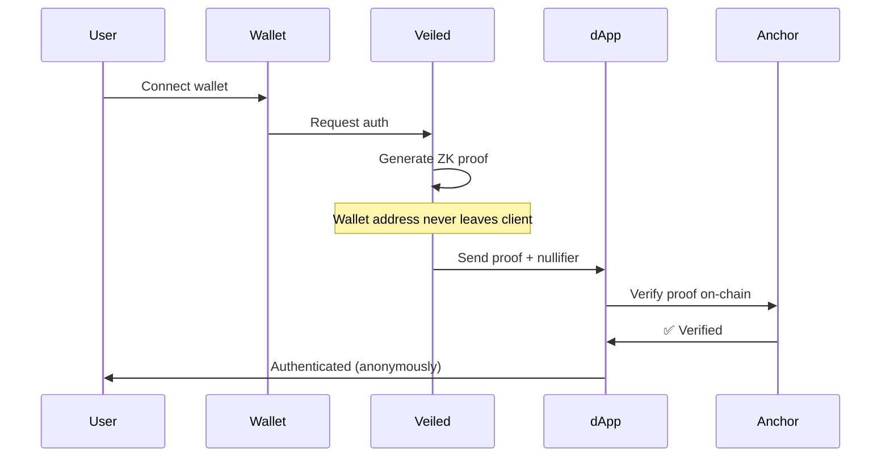

# Veiled 🔒

**Private authentication for Solana. Prove ownership without revealing your wallet.**

[](https://solana.com)
[](https://noir-lang.org/)
[](LICENSE)

Built for [Solana Privacy Hack 2026](https://solana.com/privacyhack)

---

## The Problem

When you "Sign in with Solana" today, you expose your **entire financial history**:
- ✅ Wallet balance visible
- ✅ NFT collection visible  
- ✅ Transaction history visible
- ✅ DeFi positions visible

**This is worse privacy than Web2.** Imagine if "Sign in with Google" showed websites your bank balance.

---

## The Solution

**Veiled** brings OAuth's privacy to Solana using zero-knowledge proofs.

```typescript
// Prove you own a wallet WITHOUT revealing which wallet
await veiled.signIn({
  requirements: {
    wallet: true,
    balance: { minimum: 1_000_000_000 } // 1 SOL in lamports
  },
  domain: window.location.hostname
});

// dApp receives: ✅ Verified proof, ❌ Can't see your address
```

### Key Features

- 🎭 **Anonymous Authentication** - Prove ownership without revealing wallet address
- 🎯 **Selective Disclosure** - Share only what's needed (balance range, NFT ownership)
- 🔗 **Cross-Site Unlinkable** - Different anonymous ID per dApp (can't be tracked)
- 🛠️ **Developer-First** - OAuth-like API, 3-line integration
- ⚡ **Solana-Native** - Sub-second proof verification, <$0.01 per auth
- 🔓 **Open Source** - MIT license, community-driven

---

## Quick Start

### Install SDK

```bash
bun add @veiled/core
# or
npm install @veiled/core
```

### Basic Integration

```typescript
import { VeiledAuth } from '@veiled/core';

const veiled = new VeiledAuth({
  rpcProvider: 'helius',
  // apiKey: process.env.HELIUS_API_KEY,
});

// Prove you own a wallet WITHOUT revealing which wallet
const result = await veiled.signIn({
  requirements: { wallet: true },
  domain: window.location.hostname
});

console.log('Authenticated nullifier:', result.nullifier);
```

**That's it. 3 lines of code. Your users are now authenticated privately.**

---

## Use Cases

### 🎨 NFT-Gated Access (Without Wallet Exposure)

```typescript
// Prove you own an NFT without revealing which one
await veiled.signIn({
  requirements: {
    wallet: true,
    nft: { collection: new PublicKey('DeGodsCollectionAddress') }
  },
  domain: window.location.hostname
});

// Discord bot grants access
// Bot CANNOT see which DeGod you own or what else is in your wallet
```

### 💰 DeFi (Without Revealing Net Worth)

```typescript
// Prove balance range without exact amount
await veiled.signIn({
  requirements: {
    wallet: true,
    balance: { minimum: 10_000, token: USDC_MINT }
  },
  domain: window.location.hostname
});

// Protocol gates access without seeing your net worth
```

### 🗳️ Anonymous DAO Voting

```typescript
// Prove token ownership without revealing identity
await veiled.signIn({
  requirements: {
    wallet: true,
    balance: { minimum: 1, token: GOVERNANCE_TOKEN_MINT }
  },
  domain: window.location.hostname
});

// Vote anonymously but verifiably
```

### 🎮 Gaming (Cross-Game Identity)

```typescript
// Same player across games, but untraceable
const user1 = await veiled.signIn({ 
  requirements: { wallet: true },
  domain: 'game1.com' 
});
// Nullifier: 0x7a3b...

const user2 = await veiled.signIn({ 
  requirements: { wallet: true },
  domain: 'game2.com' 
});
// Nullifier: 0x9f2c... (DIFFERENT!)

// Even if games collude, can't link you
```

---

## How It Works

### Traditional "Sign in with Solana"

```
User → Signs message → dApp sees FULL wallet address
❌ Wallet balance exposed
❌ NFTs exposed
❌ Transaction history exposed
❌ Trackable across sites
```

### Veiled Authentication

```
User → Generates ZK proof → dApp sees ONLY:
✅ "User owns a wallet" (proven)
✅ "User meets requirements" (proven)
❌ NOT the wallet address
❌ NOT transaction history
❌ NOT other holdings
```

### Technical Flow



---

## Architecture

### Components

```
veiled/
├── packages/
│   ├── circuit/          # Noir ZK circuits
│   ├── anchor/           # Solana proof verification program
│   ├── core/             # @veiled/core SDK
│   └── cli/              # Developer tools
├── apps/
│   ├── web/              # Landing page
│   └── demo/             # NFT-gated chat demo
└── scripts/              # Deployment and utility scripts
```

### Tech Stack

- **ZK Circuits**: Noir (Aztec)
- **Smart Contracts**: Anchor 0.32.1 (Rust)
- **Frontend**: SvelteKit + TailwindCSS
- **Backend**: Hono + Bun
- **RPC**: Helius / Quicknode
- **Deployment**: Vercel + Coolify

---

## Privacy Guarantees

### What Veiled Proves

✅ You own a Solana wallet (without revealing which)
✅ Your balance meets requirements (without exact amount)
✅ You own specific NFTs (without revealing token ID)
✅ You meet eligibility criteria (age, KYC status, etc.)

### What Veiled Hides

❌ Your wallet address
❌ Your transaction history
❌ Your net worth
❌ Your other holdings
❌ Your identity across different dApps

### Security Properties

- **Unlinkability**: Different nullifier per dApp (cross-site tracking impossible)
- **Non-replayability**: Nullifiers prevent proof reuse
- **Soundness**: Can't fake proofs (cryptographically guaranteed)
- **Zero-knowledge**: Verifier learns nothing beyond the claim

---

## Comparison

| Feature | Veiled | Sign in with Solana | Web2 OAuth |
|---------|--------|---------------------|------------|
| **Privacy** | ✅ Wallet hidden | ❌ Wallet exposed | ⚠️ Email exposed |
| **Control** | ✅ User-controlled | ✅ User-controlled | ❌ Platform-controlled |
| **Cross-site tracking** | ❌ Impossible | ✅ Easy | ✅ Easy |
| **Selective disclosure** | ✅ Yes | ❌ No | ⚠️ Limited |
| **Decentralized** | ✅ Yes | ✅ Yes | ❌ No |
| **Developer UX** | ✅ 3 lines | ⚠️ 20+ lines | ✅ 5 lines |

**Veiled = Best of both worlds** (Web3 decentralization + Web2 privacy)

---

## Development

### Prerequisites

- Bun v1.2+
- Rust 1.75+
- Anchor CLI 0.32.1+
- Noir (nargo)
- Solana CLI 1.18+

### Setup

```bash
# Clone repository
git clone https://github.com/yourusername/veiled.git
cd veiled

# Install dependencies
bun install

# Set up environment
cp .env.example .env
# Edit .env with your values

# Build circuits
cd packages/circuit
nargo compile

# Build Anchor program
cd ../anchor
anchor build

# Start development
bun run dev
```

### Testing

```bash
# Run all tests
bun test

# Test circuits
cd packages/circuit && nargo test

# Test Anchor program
cd packages/anchor && anchor test

# Test SDK
cd packages/core && bun test
```

---

## Project Structure

- **[packages/circuit](./packages/circuit/README.md)** - Noir ZK circuits for wallet ownership, NFT ownership, and balance range proofs
- **[packages/anchor](./packages/anchor/README.md)** - Solana on-chain program for proof verification
- **[packages/core](./packages/core/README.md)** - TypeScript SDK for developers
- **[apps/demo](./apps/demo/README.md)** - NFT-gated chat demo application
- **[apps/web](./apps/web/README.md)** - Landing page and marketing site
- **[scripts](./scripts/README.md)** - Deployment and utility scripts

---

## Roadmap

### ✅ Phase 1: MVP (Weeks 1-2)
- [x] Basic Noir circuit (wallet ownership proof)
- [x] Anchor program (proof verification)
- [x] Core SDK (@veiled/core)
- [ ] Demo dApp (NFT-gated chat)

### 🔄 Phase 2: Enhanced Features (Weeks 3-4)
- [ ] Balance range proofs
- [ ] NFT ownership proofs
- [ ] React/Svelte integration
- [ ] Multi-RPC support (Helius, Quicknode)
- [ ] Range compliance integration

### 🎯 Phase 3: Production Ready (Post-Hackathon)
- [ ] Mainnet deployment
- [ ] SDK v1.0 release
- [ ] Wallet integration (Phantom, Backpack)
- [ ] Enterprise features (SSO, SAML)

---

## Contributing

We welcome contributions! Please see [CONTRIBUTING.md](./CONTRIBUTING.md) for guidelines.

### Development Workflow

1. Fork the repository
2. Create a feature branch (`git checkout -b feature/amazing-feature`)
3. Commit your changes (`git commit -m 'Add amazing feature'`)
4. Push to the branch (`git push origin feature/amazing-feature`)
5. Open a Pull Request

---

## Security

### Responsible Disclosure

If you discover a security vulnerability, please email security@veiled.sh (DO NOT open a public issue).

### Audit Status

- Circuit audits: Pending
- Anchor program audits: Pending
- SDK audits: Pending

**⚠️ Pre-audit warning: Do not use in production with real funds until audited.**

---

## License

MIT License - see [LICENSE](./LICENSE) file for details.

---

## Acknowledgments

Built for **Solana Privacy Hack 2026**

Special thanks to:
- Solana Foundation for the hackathon
- Aztec team for Noir
- Helius for RPC infrastructure
- Quicknode for RPC services
- Range for compliance tooling
- The entire Solana community

---

## Contact

- **Twitter**: [@VeiledAuth](https://twitter.com/VeiledAuth) (coming soon)
- **Discord**: [Join our Discord](https://discord.gg/veiled) (coming soon)
- **Email**: hello@veiled.sh
- **Website**: [veiled.sh](https://veiled.sh) (veiled.vercel.app for now)

---

**Built with ❤️ for a more private Web3**

*Authentication. Veiled.*
